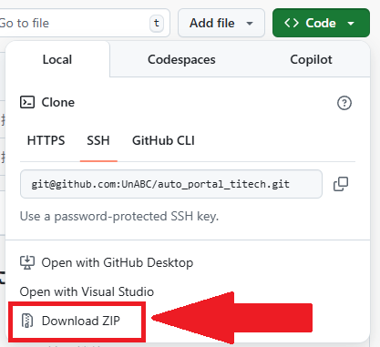
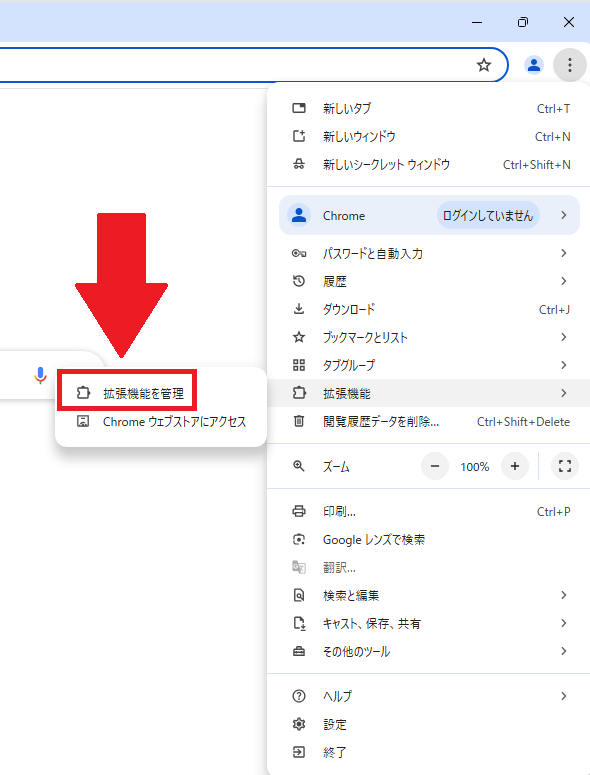
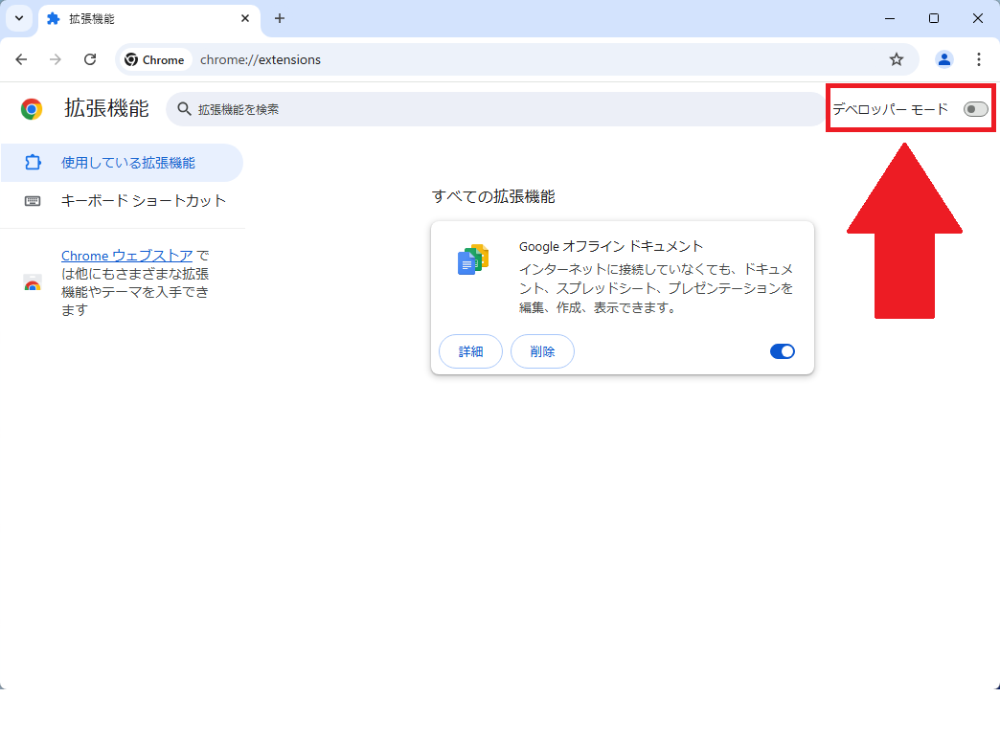
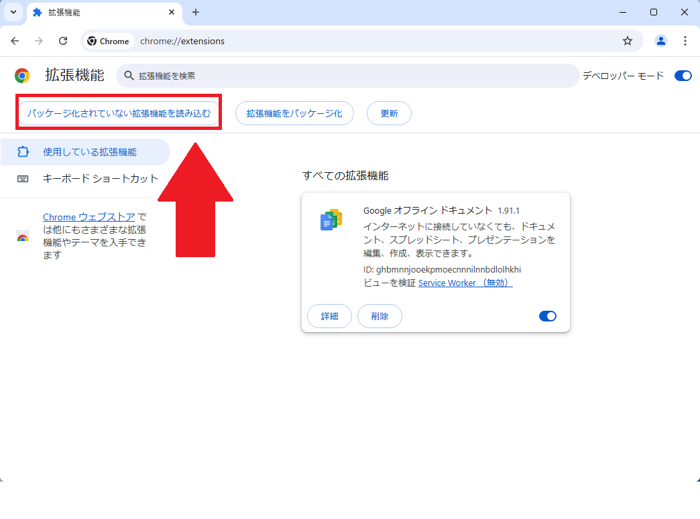
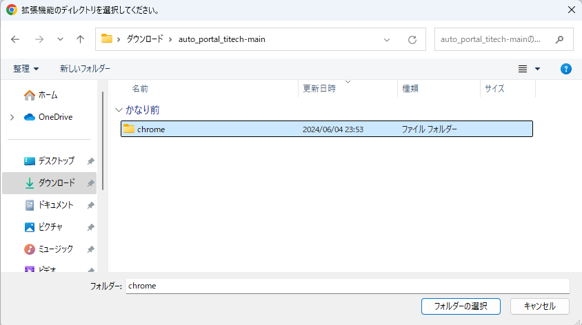
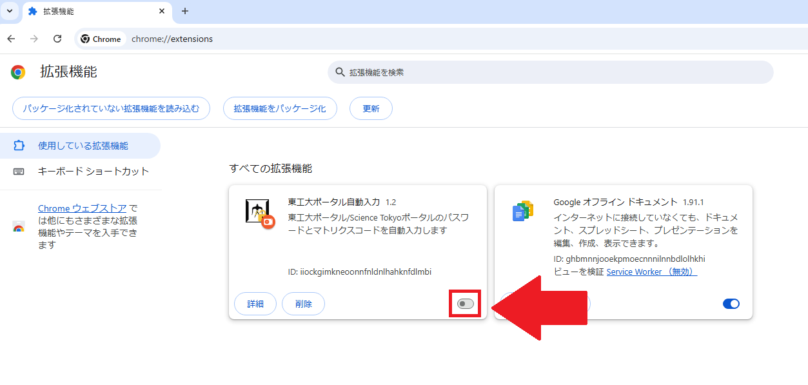
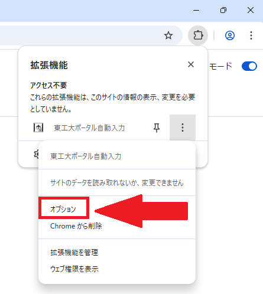

## 機能
東工大ポータルのID、PW、マトリクスコードおよびScience TokyoポータルのIDを自動入力するchromeの拡張機能です。
パスワード等は全てローカルに保存されるのでインターネット上で公開されることはありませんが自己責任でお願いします。
## 使い方  
⓪ファイルをダウンロードして解凍する  

①chromeのそれっぽいメニューから「拡張機能を管理」を選択

②右上の「デベロッパー モード」をONにする  

③なんか出るので「パッケージ化されていない拡張機能を読み込む」を選択
  
④さっき解凍したやつの「chrome」ファイルを選択

⑤拡張機能一覧に「東工大ポータル自動入力 1.2」が出てくるはずなので有効にする
  
⑥それっぽいところから「オプション」を選択する

⑦オプション画面の指示に従い、いい感じに埋める
⑧enjoy

⑨バカ  
## 免責事項  
一応暗号化して保存していますがあまり意味はないです(ソースコードを公開しているため)
このプログラムを使用したいかなる損害にも作者は一切の責任を負いません。  
あくまで自己責任で使用してください 

ライセンス：[MIT License](./LICENSE.md)